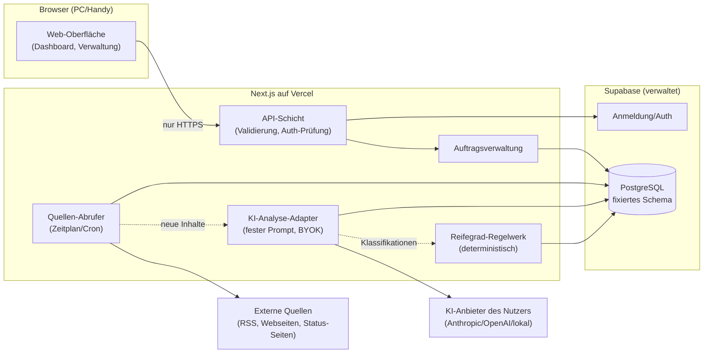

# Architektur: Evidenz-Monitor
Stand: 24.07.2026 · Status: Vorlage zu Tor 1 (Freigabe ausstehend)

## Bausteine und Datenfluss

## Verantwortlichkeiten (Klartext: "Baustein X macht Y, weil Z")

- **Web-Oberfläche** zeigt Aufträge und das Dashboard (Titel oben,
  Quellen-Graph, Bewertungspanel rechts), weil Menschen die Ergebnisse
  schnell erfassen sollen. Sie enthält keine Geschäftslogik.
- **API-Schicht** prüft bei jedem Zugriff Anmeldung und Eingaben (zod),
  weil ungültige oder fremde Zugriffe an der Grenze scheitern müssen,
  nicht tief im System. Die spätere Handy-App nutzt exakt diese API.
- **Auftragsverwaltung** legt Aufträge, Quellen und Einstellungen als
  Datensätze an, weil neue Themen durch Daten entstehen sollen, nie durch
  Code (themenneutraler Kern).
- **Quellen-Abrufer** holt in festen Intervallen neue Inhalte, erkennt per
  Hash exakte Dubletten und protokolliert jeden Lauf, weil der Ausfall
  einer Quelle sichtbar sein muss, ohne den Auftrag zu stoppen.
- **KI-Analyse-Adapter** schickt neue Inhalte mit dem festen, versionierten
  Analyse-Prompt an den vom Nutzer hinterlegten KI-Dienst und speichert
  strukturierte Aussagen, Belege und Klassifikationen, weil Textverstehen
  KI braucht — aber kontrolliert, protokolliert und mit Kostenzählung.
- **Reifegrad-Regelwerk** vergibt aus den gespeicherten Klassifikationen
  deterministisch die Stufe 1–8 und schreibt jede Änderung mit Auslöser in
  den Verlauf, weil Bewertungen reproduzierbar und beweisbar sein müssen —
  die KI vergibt niemals selbst Stufen.
- **Supabase (Auth + PostgreSQL)** verwahrt Konten und Daten mit
  automatischen Backups und Zeilen-Sicherheit (jeder sieht nur eigene
  Aufträge), weil Anmeldung und Datenbankbetrieb nicht selbst gebaut
  werden sollen (Sicherheit, Wartungsarmut).

## Modulgrenzen und Abhängigkeitsrichtungen (bindend)

1. UI → API → Fachlogik (AV/Sammler/Analyse/Regeln) → DB. Nie umgekehrt,
   keine Abkürzungen (UI spricht nie direkt mit der DB).
2. Nur der **Quellen-Abrufer** greift auf externe Quellen zu; nur der
   **KI-Adapter** spricht mit KI-Diensten. Der Abrufer arbeitet über eine
   feste Adapter-Schnittstelle (RSS, Web); zusätzlich existiert eine
   **Ingest-API**, über die externe Sammler (eigene Agenten, n8n-Flows)
   mit Auftrag-gebundenem Token Inhalte im Standardformat einliefern
   (ADR 0002). Eingelieferte Inhalte durchlaufen dieselbe Validierung,
   Analyse und Bewertung wie selbst abgerufene.
3. Das **Regelwerk** ist reine Logik ohne Netzwerk- und KI-Zugriff —
   dadurch vollständig testbar.
4. Schnittstellen der API sind versioniert (`/api/v1/...`); Breaking
   Changes nur als neue Version (SemVer).
5. Schema-Änderungen nur per Migration + ADR.

## Sicherheitsentscheidungen (Vertrag)

- HTTPS überall; Anmeldung Pflicht für alles außer Login-Seite.
- Row Level Security in Postgres: Datenzugriff nur auf eigene Aufträge.
- BYOK-Schlüssel verschlüsselt gespeichert, niemals geloggt, niemals an
  den Browser zurückgegeben.
- Least Privilege: Server nutzt eingeschränkte DB-Rollen, keine
  Admin-Verbindung im Anwendungsbetrieb.
- Externe Inhalte gelten als nicht vertrauenswürdig: KI-Antworten werden
  gegen ein festes JSON-Schema validiert; Anweisungen aus Quelltexten
  werden nie ausgeführt (Schutz vor Prompt-Injection aus Quellen).

## Datenmodell

Fixiert in `SCHEMA.sql` (11 Tabellen). Kernprinzipien: Reifegrad lebt
ausschließlich im append-only Verlauf (nichts wird überschrieben);
Dubletten werden über Gruppen + Beziehungstyp abgebildet, damit
Übernahmen nie als unabhängige Bestätigungen zählen; jeder KI-Lauf wird
mit Prompt-Version und Tokenverbrauch protokolliert.
